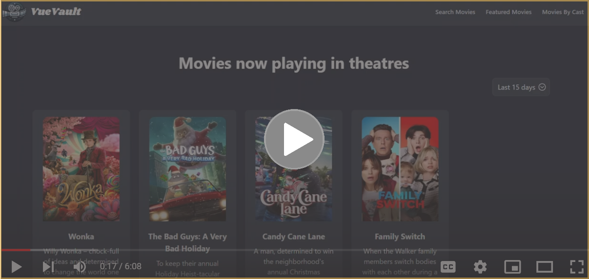

# VueVault: Your Personal Movie Universe 🎥

Welcome to VueVault, where movies come alive right at your fingertips! Imagine a world where discovering your next favorite film is just a click away. That's VueVault for you - a delightful blend of technology and movie magic🌟.

Powered by Vue.js and Tailwind CSS, this dynamic web application makes discovering movies a breeze.

## Behind the Scenes: The Tech Ensemble

VueVault isn't just built; it's crafted with passion, using the coolest tech in the block:

- **Vue.js**: Our hero! Vue brings VueVault to life, making everything reactive and snappy.
- **Tailwind CSS**: The fashionista! Tailwind dresses VueVault in a sleek, responsive outfit. No device is too big or too small.
- **Axios**: The messenger! Need movie data? Axios fetches it faster than you can say "VueVault!"
- **Vite**: The speedster! Vite gets VueVault running quicker than a superhero.
- **Vuex**: The brain! Vuex keeps our movie data in check, organized, and ready to go.
- **Vue Router**: The guide! It navigates us through the VueVault universe without missing a beat.
- **Node.js & npm**: The foundation! They keep our toolbox stocked and ready.

Each piece of our tech stack was picked not just for its LL Cool J's cool factor, but to solve real-world challenges in the universe of web app development.

## 🎬 VueVault in Action: A Cinematic Experience

Ready for a sneak peek into the VueVault universe? Click the image below and be transported to a cinematic showcase of VueVault's features. It's not just a demo; it's an experience!

## Epic Adventures & Victories 🚀

### Challenges Tackled:

- **Taming the TMDb API**: It was a wild ride figuring out the API's quirks, but with some clever caching and error-handling wizardry, we made it our ally.
- **The Quest for Responsive Design**: Armed with Tailwind CSS, we conquered every screen size, making VueVault a delight on any device.

### Development Triumphs:

- **The Magic of Search**: Crafting an intuitive search experience was our holy grail. Thanks to Vue's reactivity and Axios's data-fetching spells, we nailed it!
- **Crafting a World of Engagement**: Tailwind CSS helped us weave an interface that's not just pretty, but interactive and addictive.

## The Future Awaits: VueVault's Destiny 🌌

VueVault is more than a project; it's an ever-growing realm of possibilities. Here's what's brewing in our cauldron 🧙‍♂️:

- **Personalization Potions**: User profiles, preferences, and a dash of movie recommendations tailored just for you.
- **Global Charms**: Making VueVault multilingual, because great movies speak all languages.

Stay tuned, the best is yet to come!

## Prerequisites

Before you dive in, make sure you have these tools ready:

- A keen sense of adventure (and some familiarity with command line interfaces, CLI)
- [Node.js](https://nodejs.org/), the backbone of our JavaScript journey
- A text editor or IDE, like [Visual Studio Code](https://code.visualstudio.com/), to weave your magic
- JavaScript, enabled and ready in your web browser

## Installation Guide

Let's get VueVault up and running on your local machine:

### Step 1: Node.js and npm

First, the basics:
- Download and install Node.js from [here](https://nodejs.org/).
- Verify the installation with a quick `node -v` and `npm -v` in your CLI.

### Step 2: The Magic of Vue.js and Vite

No need to install these separately, as they magically appear during our next step!

### Step 3: Cloning the Repository

Time to get your own copy of VueVault:
- Open your CLI.
- Navigate to your desired folder.
- Run `git clone https://github.com/paolacernada/vuevault.git`.
- Switch to the project directory: `cd VueVault`.

### Step 4: Dependency Party

Let's invite all our dependencies:
- Run `npm install`.

### Step 5: Tailwind CSS (Only if You're Fancy)

If Tailwind CSS is playing hide and seek (missing `tailwind.config.js`):
- Run `npm install tailwindcss`.
- Then, `npx tailwindcss init`.

### Step 6: Spill the Secrets (Environment Variables)

Create or edit a `.env` file in the project root. Add `VITE_API_BASE_URL` and any other
